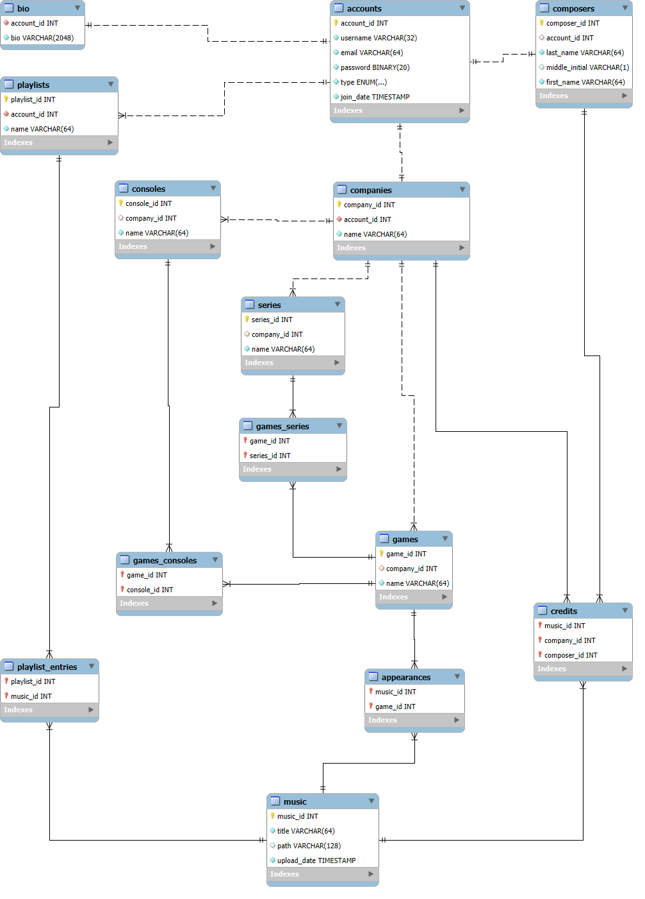

# Design Document

By Justin Rainier Go

Video overview: (TODO)

## Scope

This database is meant to span the collection of *video game music* (VGM) while emphasizing the composers behind these compositions. Spotify and Apple Music already do a good job of handling "conventional songs" (songs made by artists and which play on the radio), so these songs would be outside the scope of this VGM database. VGM differs from conventional songs because VGM tends to be relatively underlooked and underappreciated, whereas conventional songs tend to be more universally recognized: a shame for VGM composers in the gaming industry.

Worse still, [a recent app meant for listening to VGM, Nintendo Music, does not yet credit their composers,](https://www.theverge.com/2024/11/5/24288201/nintendo-music-streaming-hands-on-impressions) instead opting to label their music only under their associated video game. Apps connecting to this database could allow users to have a pleasant experience listening to VGM while at the same time crediting the composers of these, celebrating an important aspect of video games.

## Functional Requirements

A user must be able to:

1. Sign up for a user account.
2. View all music composed by or for a company, composer, game, series, console, or a combination thereof.
3. Define playlists, which are an arbitrarily-chosen sequence of VGM to play through.

Further, VGM composers must be able to:

1. Sign up for a composer account.
2. Submit, manage, and remove their VGM to and from the database.

Finally, video game companies must be able to:

1. Sign up for a company account.
2. Submit, manage, and remove consoles, games, series, and VGM to and from the database.

## Representation

### Entities

(TODO: Describe entities chosen to represent the tables.)

#### Attributes

The `composers` table contains a unique `composer_id` alongside name fields and an associated `account_id`. The name fields technically expect an English name by providing three columns for `last_name`, `middle_initial`, and `first_name`. However, since names in other languages may not have a "middle initial", such as Japanese and Chinese names, only the last and first names are required. Not all composers may be interested in creating an account for this database too, so an `account_id` is optional in this table.

#### Types

Interestingly, the `music` table uses a `path` column to locate the actual VGM file instead of using a `BLOB` or other binary type. This offloads the retrieval of VGM music data to the external file system any applications will be using in conjunction to this database as file systems are optimized for this sort of thing.

#### Constraints

Most entities have a primary key that an unsigned autoincrementing integer; an unsigned integer can hold twice as many IDs as a signed one, and autoincrementing it makes adding a new entity more convenient.

Based on [the erratum for RFC 3696,](https://stackoverflow.com/questions/386294/what-is-the-maximum-length-of-a-valid-email-address/574698#574698) "an email address must not exceed 254 characters". However, email addresses approaching that limit tend to be impractical and even maliciously used by bad actors, hence a shorter limit of 64 (around 1/4 of the real limit) was used instead.

### Relationships



The `games_consoles` tables manages the many-to-many association of video games to consoles. One example of a game released for multiple platforms is Minecraft, which has been released for PC, mobile phones, and various consoles.

## Optimizations

In this section you should answer the following questions:

* Which optimizations (e.g., indexes, views) did you create? Why?

## Limitations

One weakness of this database is that it might not be able to represent the VGM of older video games that have been released in multiple consoles very well. Modern video games released in different platforms have around the same music thanks to standardized file formats, but retro video games may have [music that sounds different between consoles despite sharing a name](https://www.youtube.com/watch?v=iFjOs5vT__M) thanks to the various limitations of the time.

Adding another dedicated column for this seems unwieldy as this is only an issue for retro games. Ultimately, this could be represented by appending console names in parentheses in the `music` table, but it may appear clunky:

```txt
name
------------------
Intro Stage (SNES)
Intro Stage (PS)
```

* "SNES" stands for *Super Nintendo Entertainment System*.
* "PS" stands for *PlayStation*.

Aside from this, images (such as album art, video game cover, profile pictures, etc.) are not currently supported as it is out of the scope of VGM. It could be implemented easily by adding new tables associating an image with a song, game, series, console, or any other entity in this database, but that may detract from this initial proof-of-concept.
